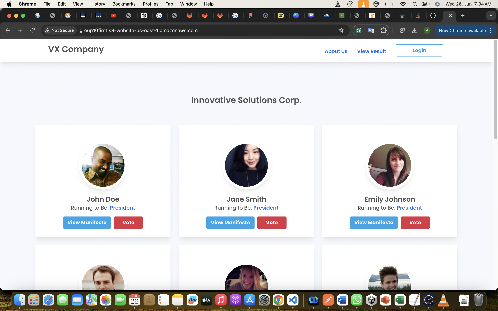
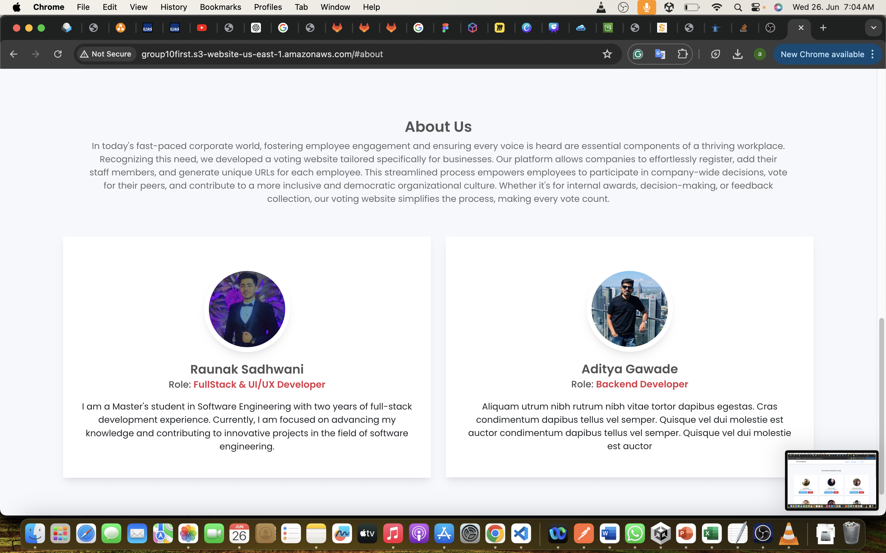
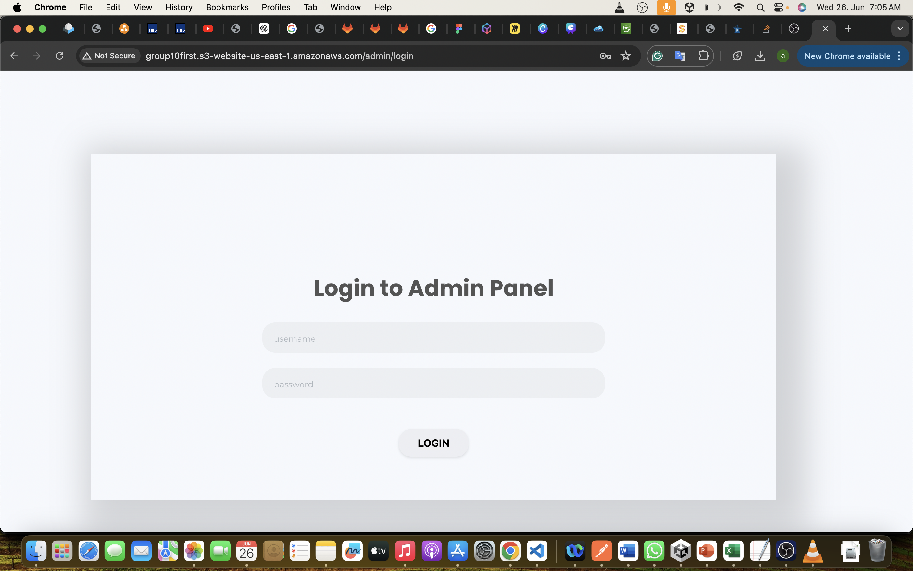
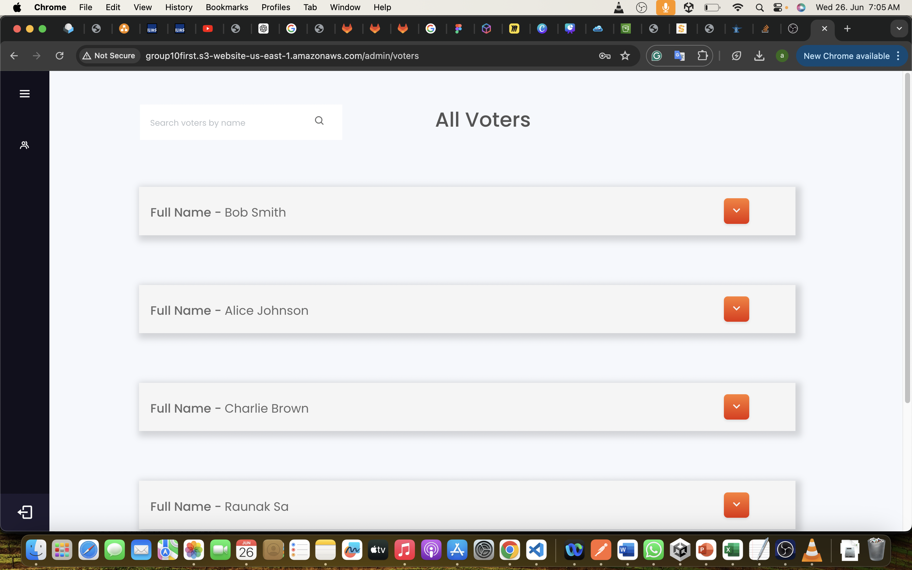
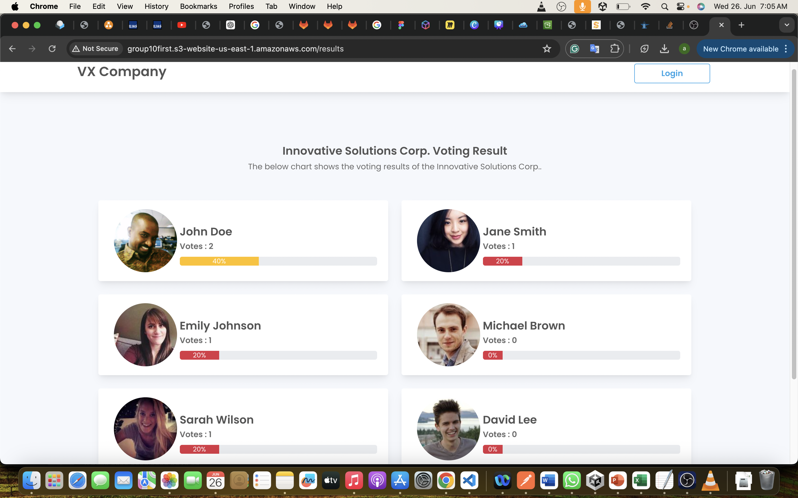
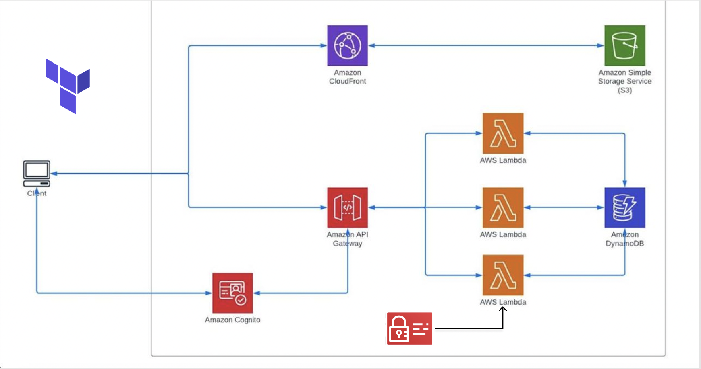

 

# Voting Management System

###### Prof. Dr Thomas Fankhauser | Cloud Computing  | Hochshule Heilbronn 

---

 
<table>
    <tbody>
        <tr>
            <td>Students (ID)</td>
           <td>Aditya Gawade(agawade), Raunak Sadhwani (rsadhwani)</td> 
        </tr>
        <tr>
            <td>Semester</td>
            <td>Summer Semester 2024</td>
        </tr>
        <tr>
            <td>Repository</td>
            <td><a href="https://git.it.hs-heilbronn.de/it/courses/msem/cc2/ss24/group10</a>&nbsp;</td>
        </tr>
        <tr>
            <td>Course ID</td>
            <td>172369 </td>
        </tr>
        <tr>
            <td>Course Name </td>
            <td>Cloud Computing (SEM)</td>
        </tr>
    </tbody>
</table>

## Chapter 1 - Introduction

The project involves the development of voting Management System, serving as a centralized platform for efficient way to take voting which can help organisation to elect good candidate. This system facilitates the management of votes from employee of organisation.

Amazon Cognito Integration:
Amazon Cognito is integrated for robust identity management and user authentication.
In our project we used it for login to admin portal to check how many people voted till now. in1. stead of using hosted ui provided by cognate we used tokens to atuhrize persons identity.

To provide a user-friendly interface, the frontend of the application was developed as a static website using vue and JavaScript. The frontend interacts with the backend through API endpoints to fetch a list of available voters table, voter_id, voter_name, voter_email.
.

The backend of the application is built as a serverless application using AWS Lambda and JS. The backend exposes Representational State Transfer (REST) API endpoints that handle requests from the frontend. The data is stored in DynamoDB, a cloud database service provided by AWS. The use of serverless architecture allows for automatic scaling based on demand, ensuring efficient resource allocation.

### 1.1 Application Working 
Our website enables employees to cast votes for electing candidates to various organizational positions. Employees can visit the site to view candidate details, including manifestos, before casting their votes. After selecting a candidate, employees must enter their name, email, and voter ID provided by the organization. A "View Result" button allows employees to see the number of votes each candidate has received.

The backend of the application is built as a serverless application using AWS Lambda and JavaScript. It exposes Representational State Transfer (REST) API endpoints that handle requests from the frontend. Voting data is stored in DynamoDB, a cloud-based database service provided by AWS. The serverless architecture ensures automatic scaling based on demand, enabling efficient resource allocation.  The application also performs create operations for voters using the POST method, allowing new voters to be registered seamlessly. This approach ensures a secure, efficient, and transparent voting process, providing a user-friendly experience for all employees within the organization.

### 1.2 Functionality
The functionality of our application is as such:
Our project is exclusively accessible to admin teams, ensuring secure access and management. For authentication, we integrated AWS Cognito, allowing admins to log in via a Cognito user pool. Upon logging in, admins can fetch data from the company table, which contains details of candidates interested in positions such as CEO, President, Senior Manager, and Managing Director. Admins can add this data to DynamoDB.
Employees, who are the voters, can visit the website to vote for the candidate they believe is most suitable for a position. They need to enter their details, including name, email, and voter ID provided by the organization. The backend, built as a serverless application using AWS Lambda and JavaScript, handles data passed through REST API endpoints. The data is stored in DynamoDB. for viewing results, employees can click on the "View Result" button on the same portal to see the voting outcomes. This setup ensures a secure, efficient, and transparent voting process, providing a seamless experience for both admins and employees.

### 1.1 screenshots of the application:
Here are some screenshots of the frontend of the application which is available at 

Figure 1.1.1 Home Page 

Figure 1.1.2 - About us

Figure 1.1.3 - Admins Page

Figure 1.1.4 - voter List

Figure 1.1.5 - Result

## Chapter 2 - Architecture 
**2.1 setup of architecture**
We planned our application requirements in a simple format and looked for suitable AWS services and structured the architecture

Figure 2.1 - Architecture of Voting managemnt project

**2.2 AWS - Services Used**

The application uses the following AWS services:

1. **AWS Lambda:** Executing the backend JavaScript code responsible for handling REST API requests. It reads, writes and detlete data to the database. Lambda was chosen for its serverless nature, automatically scaling and eliminating the need for server management.
2. **DynamoDB**: A NoSql database, was used in storing and retrieving  data about employees details. DynamoDB was used because it provides table ,fast and predictable performance with seamless scalability. It is a managed NoSQL database which fits well with our serverless architecture.
3. **API Gateway**: For exposing the API endpoints and to interact with the lambda backend.
4. **Identity and Authorisation Management** **(IAM)**: IAM plays a crucial role in managing access control , policies and permissions for various AWS services, including DynamoDB. It ensures that only authorized entities have the necessary permissions to interact with specific resources.
5. **Simple Storage Service** (s3): Amazon CloudFront is employed as a content delivery network (CDN) to distribute static website content globally, enhancing performance, reliability, and security. S3 (the name is dynamically generated by concatenating the resource type ("aws_s3_bucket") with the random identifier from the ), in conjunction with CloudFront, offers a scalable and cost-effective solution for hosting and delivering static website content.
6. **Amazon Cognito** :  Integrated for identity management and user authentication. Cognito allows you to easily add user sign-up, sign-in, and access control to web and mobile apps.

The application scales out automatically as AWS lambda and dynamodb automatically scales out whenever we create more no. of employees. When employees are added, lambda handles the workload concurrently.

**2.4 Data Model**

The data model of the application includes entities such details. The data model is stored in DynamoDB and follows a NoSQL structure. The attributes of the Employee data is shown in Table 1.2

**Table 1.2 - Data model company Table**

company Table--

<table>
    <!-- <tbody> -->
        <tr>
            <td><strong>Attribute</strong></td>
            <td><strong>Data Type</strong></td>
        </tr>
        <tr>
            <td>company name</td>
            <td>String</td>
        </tr>
        <tr>
            <td>company descriptions</td>
            <td>string</td>
        </tr>
        <tr>
            <td>voting role</td>
            <td>string</td>
        </tr>
        <tr>
            <td>user name</td>
            <td>string</td>
        </tr>
        <tr>
            <td>user description</td>
            <td>String</td>
        </tr>
        <tr>
            <td>user manifesto</td>
            <td>String</td>
        </tr>
        <tr>
            <td>user votes</td>
            <td>Number</td>
        </tr>
       
   
</table>

voters table

<table>
    <tbody>
        <tr>
            <td><strong>Attribute</strong></td>
            <td><strong>Data Type</strong></td>
        </tr>
        <tr>
            <td>voter_id</td>
            <td>String</td>
        </tr>
        <tr>
            <td>voter_name</td>
            <td>string</td>
        </tr>
        <tr>
            <td>voter_email</td>
            <td>string</td>
        </tr>
        <tr>
            <td>voted_for_id</td>
            <td>string</td>
        </tr>
       
    
</table>

 **2.5 Application Programming Interface (API)**

The application exposes REST API endpoints to enable communication between the frontend and the backend. These endpoints handle requests for fetching company data , updating by id , deleting and creating new employee data. The communication between the frontend and the backend occurs over HTTP protocols.

The communication between the frontend and backend is facilitated by the API Gateway, which acts as a mediator for the requests and responses.

 Table 2.2 - Api endpoints exposed by api gateway

<table>
    <tbody>
        <tr>
            <td>Description</td>
            <td>HTTP Method</td>
            <td>Relative URL</td>
            <td>Request</td>
            <td>Sample Response</td>
        </tr>
        <tr>
            <td>Cast vote</td>
            <td>POST</td>
            <td>/VotingData</td>
            <td>Post operation</td>
            <td>Records inserted successfully!</td>
        </tr>
        <tr>
            <td>Retrieve a candidate data</td>
            <td>GET</td>
            <td>/CompanyData</td>
            <td>Get operation</td>
            <td>All Candidate data</td>
        </tr>
        <tr>
            <td>Voter details</td>
            <td>POST</td>
            <td>/VoterData/:id</td>
            <td>Post operation</td>
            <td>Data added successfully!</td>
        </tr>
    </tbody>
</table>
    **2.6 Communication between all components**
In this system, different AWS components work together to keep everything running smoothly. Users start by making requests through API Gateway, which sends these requests to JavaScript code running on AWS Lambda. This code then talks to DynamoDB, a NoSQL database, to store and get information about voters and candidates. IAM ensures that access to these services is secure. Amazon Cognito manages user login and identity, and AWS CloudFront helps deliver content quickly around the world and connects users to Cognito for authentication.

## Chapter 3 -  Tooling
**3.1 Working on the application**
### How does a developer work on your application 
- step 1: git clone 
- step 2: git pull
- step 3: If the access key and Security Key is not added in the git repo then developer should add these keys in main.tf.
- step 4: check the region, change accordingly to his current region. 
- step 5: terraform init 
- step 6: terraform plan 
- step 7: terraform apply --auto-approve
- step 8: terraform apply --auto-approve
- step 9: In terminal we will have domian endpoints Url then use the url to access our application

- 

**3.3 Deployment Process
Code changes in the serverless voting management platform are deployed using GitLab's CI/CD pipelines. The deployment process involves the following steps:

Version Control and Collaboration: Developers utilize feature branches in the Git repository and collaborate via GitLab's version control system. Each new feature or bug fix is developed in its own branch.

Continuous Integration/Continuous Deployment (CI/CD): GitLab's CI/CD pipeline automatically triggers when changes are pushed to the repository. It facilitates automated builds, tests, and deployments. Occasionally, the build process may experience delays due to CloudFront integration.

Test and Deploy: Within the pipeline, code changes undergo building, testing, and packaging in preparation for deployment.

Terraform: As an Infrastructure as Code tool, Terraform automates the setup and management of infrastructure, ensuring deployments are consistent and reproducible. It defined essential AWS resources like API Gateway, Lambda functions, DynamoDB, and IAM policies for our application.

Lambda Testing: Using Jest tests, GitLab CI/CD pipelines automatically execute tests whenever there are code changes in the repository, ensuring continuous validation of Lambda functions.

CI/CD: GitLab CI/CD seamlessly integrates with Terraform, automatically applying configurations upon code deployment. This process efficiently manages AWS resources, handling creation, updates, or deletions as required by the application's evolving needs.

## Chapter 4 - Lessons Learned
### 4.1 - Learnings

We started an exciting journey into cloud platforms, moving from complex setups to easily scalable hardware with simple configurations. We learned to deploy static websites, create REST APIs with Cognito for user authentication, optimize content delivery with CloudFront, implement Lambda functions, and perform CRUD operations with DynamoDB.

We faced challenges like a 403 Forbidden error during API testing, which required policy adjustments, and CORS errors during URL automation and API deployment, which we resolved creatively. This journey improved our technical skills and troubleshooting abilities.

Activities accomplished:

*Deployed a static website.
*Defined a REST API.
*Used Cognito for user authentication.
*Optimized content delivery with CloudFront.
*Implemented Lambda functions.
*Interacted with DynamoDB for operations.

### 4.2 - Challenges Faced and Solutions (complicated)

### 4.2.1 - 403 Forbidden Error for API Testing

- 
We encountered a 403 Forbidden error during API testing, which required a careful review and adjustment of our IAM policies to ensure the correct permissions were granted for accessing the API.

## Referance <a href="https://medium.com/collaborne-engineering/403-cursed-by-cors-d1700cab754">https://medium.com/collaborne-engineering/403-cursed-by-cors-d1700cab754</a>

### 4.2.2 - CORS Error Resolution

- Resolving CORS errors involved configuring the appropriate CORS headers in our API Gateway responses to allow cross-origin requests from the frontend application. Additionally, we adjusted the AWS Lambda function permissions and integrated CORS handling directly within our serverless application to ensure seamless communication between different origins.
## Referance <a href="https://docs.aws.amazon.com/apigateway/latest/developerguide/how-to-cors.html">https://docs.aws.amazon.com/apigateway/latest/developerguide/how-to-cors.html
</a>

### 4.2.3 - Route error 
- The api url was fetched from the html file using a json file. First we performed echo operation to save the api url in a json file(api_url.json). This echo operation is done in the output.tf file. The api_url is saved in the json file as a key-value pair and this file is created in the frontend folder. 
From the json file, we are fetching the url into the html file using fetch operation in  tag. We are reading the json file and saving the value of the api_url key into a variable “apiUrl”. This apiUrl is made to be globally accessible and is used in code for GET, POST and PUT operation. 
The url is saved to a variable when we run the terraform apply cmd once. 
In order to fetch the api url for performing operations from the frontend web page, we have to run terraform apply once again, i.e we run terraform apply twice overall. This is one of the challenge we faced and found that running the terraform apply cmd twice, can fetch us the required url to perform the operations from front end.

### 4.2.4 - Difficult to integrate cognito

Integrating Cognito proved to be challenging due to its complex configuration requirements and the need for precise setup to handle user authentication and authorization correctly. We encountered difficulties in managing user pools, configuring identity providers, and ensuring seamless integration with other AWS services.

### 4.2.4 - CI/CD pipeline not Working

## Referances
## 1  "https://medium.com/carlos-hernandez/user-control-with-cognito-and-api-gateway-4c3d99b2f414

## 2  "https://spacelift.io/blog/terraform-in-ci-cd

## 3  "https://spacelift.io/blog/terraform-api-gateway

## Chapter 5 - Conclusion

- In this course, we explored the fundamentals of cloud computing and developed a serverless application using Terraform. We learned how various AWS services interact and how to implement these interactions through Terraform. As part of the course, we applied our knowledge to create a serverless "voting Management Portal." This project allowed us to gain hands-on experience in building cloud-based solutions, emphasizing the seamless communication between AWS components and the practical implementation of serverless architecture. Overall, the course provided a comprehensive introduction to cloud computing concepts and Terraform's role in managing infrastructure as code.

# Project Video

